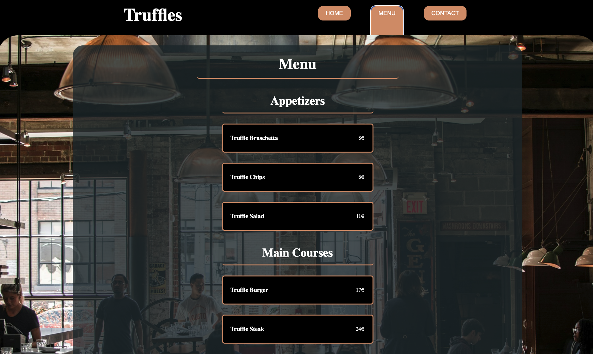

# Restaurant Page

This project showcases a simple restaurant website built as part of an assignment to practice Webpack, modular JavaScript, and dynamic DOM manipulation. The project demonstrates the use of Webpack for efficient bundling, JavaScript for dynamically generating content, and GitHub Pages for deployment. 

A live version of the project: https://theografiska.github.io/restaurantPage/



Below are the highlights of the project:

---

## Project Overview

### **Setup and Development Process**
1. **Webpack Configuration**:
   - Initialized the project with `package.json` and set up Webpack for module bundling.
   - Configured Webpack based on project needs (e.g., no `html-loader` since no local images were linked in the HTML).

2. **HTML Skeleton**:
   - Created a minimal `src/template.html` containing a `<header>` with a `<nav>` bar and an empty `<div id="content">`.

3. **Dynamic Content with JavaScript**:
   - Developed a homepage dynamically by appending elements to `div#content` via a dedicated JavaScript module.
   - Implemented tabbed navigation (Home, Menu, Contact) with individual modules for each tab:
     - Each module exports a function to generate and style its content.
     - Tab-switching logic dynamically clears and reloads the `div#content`.

---

## Features

- **Modular Design**:
  - Separated logic into modules for better scalability and maintainability.
  - Centralized event listeners in `index.js` for seamless tab switching.

- **Dynamic Content**:
  - Populated the website dynamically through JavaScript instead of static HTML.
  - Enhanced interactivity using event-driven architecture.

- **Deployment**:
  - Deployed the project to GitHub Pages by bundling the app into the `dist` directory.
  - Configured GitHub Pages to serve from the `gh-pages` branch using `git subtree push`.

---

## Deployment Steps

1. **Branch Setup**:
   - Created a new branch `gh-pages` for deployment.
   - Merged the latest changes from the `main` branch.

2. **Building and Deploying**:
   - Bundled the application using `npx webpack`.
   - Deployed the contents of the `dist` directory to `gh-pages` using:
     ```bash
     git add dist -f && git commit -m "Deployment commit"
     git subtree push --prefix dist origin gh-pages
     ```
   - Updated the GitHub Pages source branch to `gh-pages` in repository settings.

---

Enjoy exploring the restaurant page! 🚀